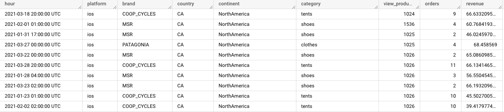
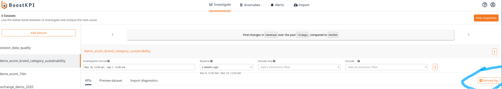
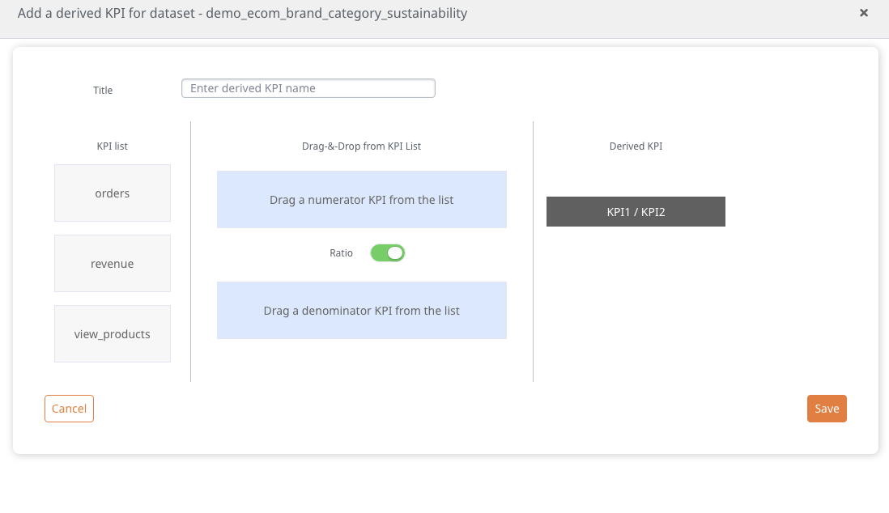
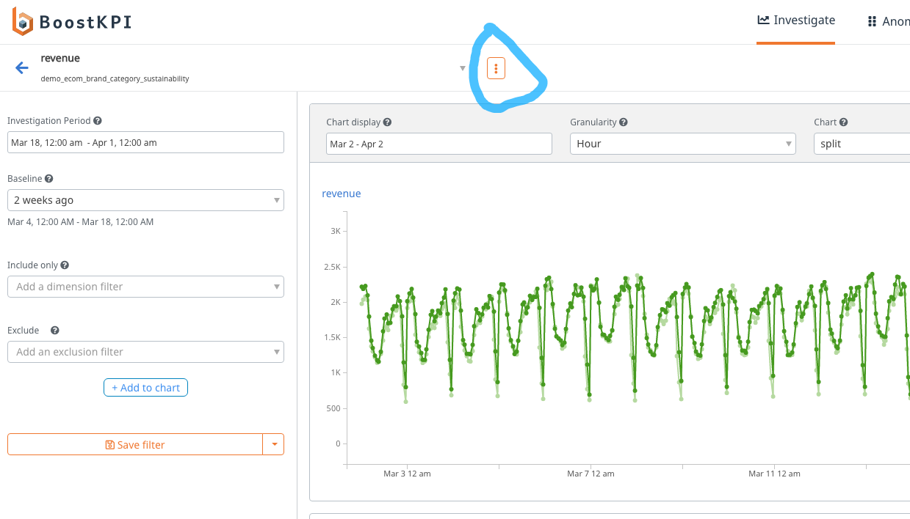
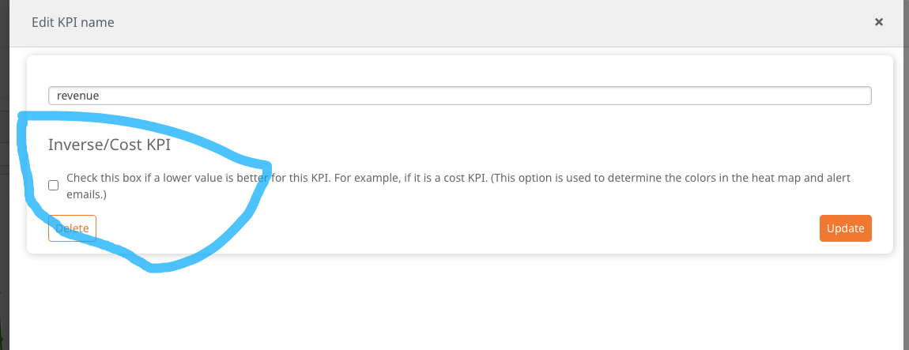
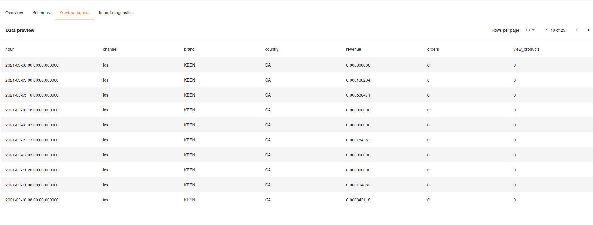
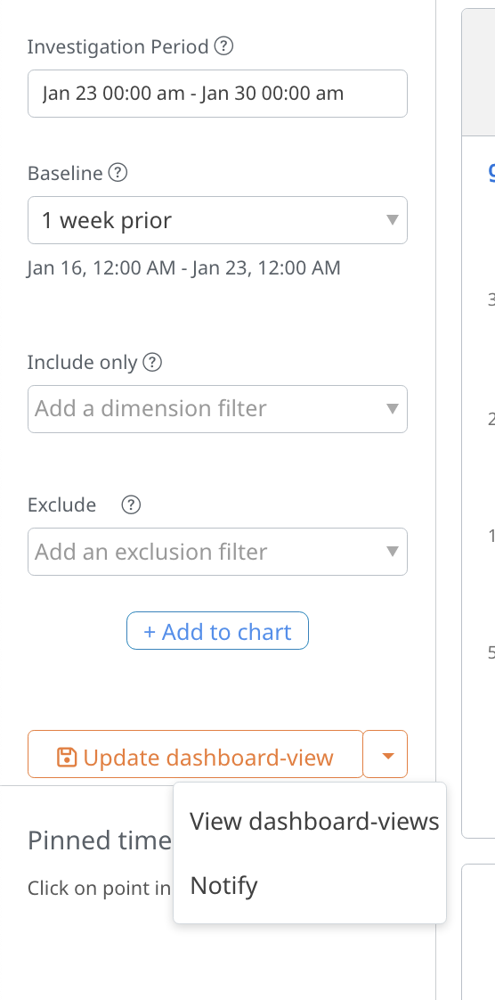

## What is a dataset / KPI?

A dataset represents a time-series of metrics or KPIs broken down by 
multiple dimensions of interest. For example, an e-commerce marketplace’s revenue dataset may be 
an hourly data of view products, orders and revenue broken down by:
Platform (that the user is using to make the purchase)
- Brand
- Country
- Continent
- Product category

For example, the table below shows a dataset that is suitable for 
analysis by BoostKPI.

A KPI is an important metric that the business uses to make important 
decisions. In the above example, revenue, orders, and view_products 
are example KPIs.

## Managing datasets

You can add new datasets by clicking on the “Add dataset” button. You can then upload 
a csv or setup a dataset as a result of a sql query. 

If you no longer plan to use a dataset, you can click on “Edit dataset” and hit “Delete” to delete the dataset.

You can also use the search bar (above the list of datasets) to search for a specific dataset.

## Creating a derived KPI

Create a derived KPI by clicking on the button below.

You can then create a new KPI such as views-to-purchases-ratio defined as 
the ratio of the number of purchases to the number of views by doing a 
drag and drop.

## Marking KPI as a cost metric

##### Step 1

##### Step 2

Marking a KPI as a cost metric reverses the colors in the heatmap, the 
drilldown, and the alerts. Green is used if the KPI value decreases. 
Examples of cost metrics are CPC (cost per click) or CPL (cost per lead).

## Raw data preview

You can see raw data used for analysis on Dashboard -> Schemas > Preview dataset.

## Dashboard-view

A dashboard-view enables users to customize the way they view KPIs in 
BoostKPI. For example, a manager at an online retailer might want to 
see the revenue and AOV in the US at a weekly level. To do so, she 
can click on the revenue KPI, add the appropriate country filter, update 
the charts, add the AOV chart, and then save it as a dashboard-view.

The dashboard-view is then present on the dataset page. She can also get 
a daily update of the latest data emailed to her by clicking on “notify” 
when viewing the contents of a dashboard-view. (The url includes a viewId 
when a dashboard-view is being displayed).

## Lookup datasets

A lookup dataset is a mapping dataset that specifies the mapping of 
existing column values from a (time-series) dataset to a new column. 
Lookup datasets can currently only be added via a csv import. 
[See this FAQ on how to create a lookup dataset.](/data-import/index.md#csv-file-import)