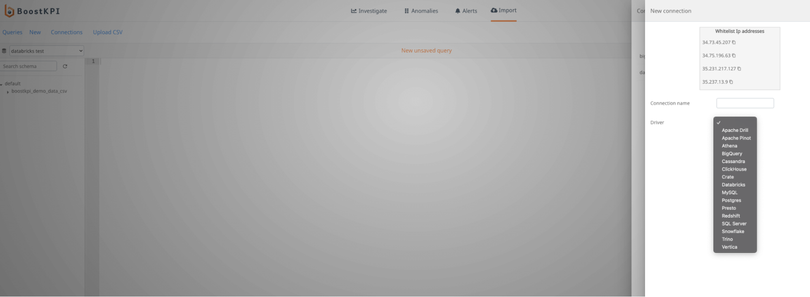
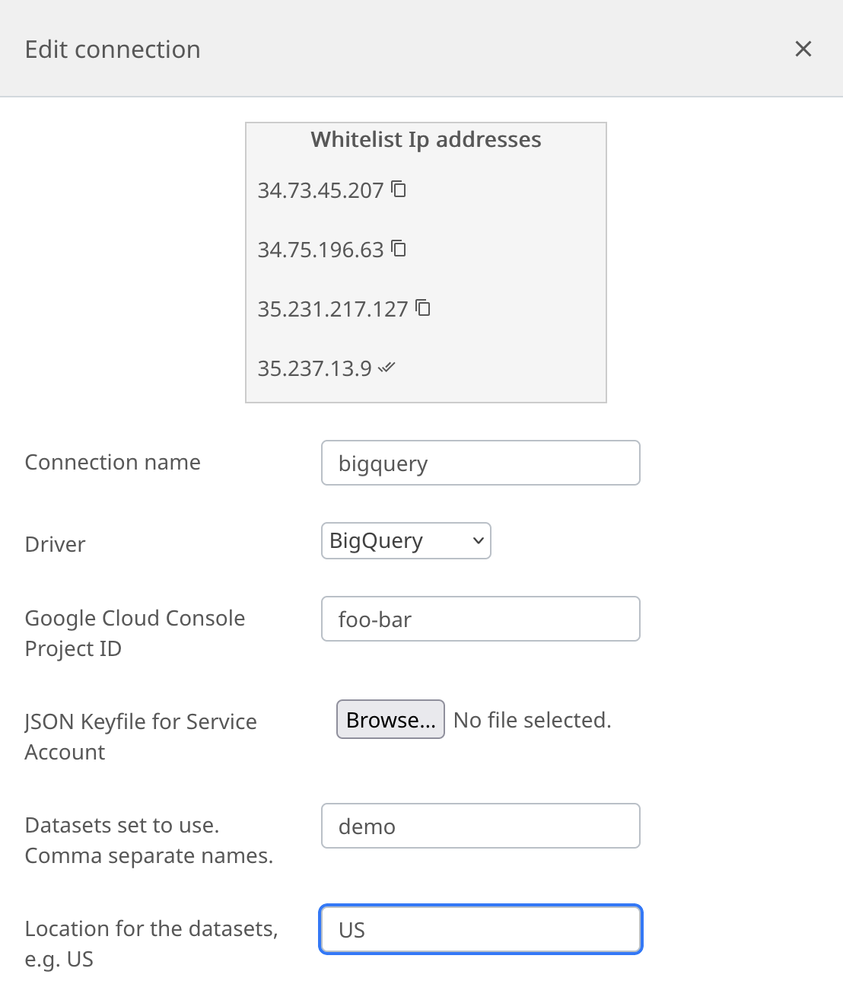
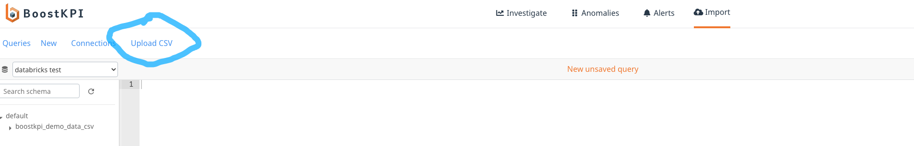

## Supported data sources

BoostKPI can connect to many different data sources that support a SQL interface. The current list of supported data sources includes:
- Amazon Athena
- Amazon Redshift
- Apache Pinot
- Google BigQuery
- ClickHouse
- Databricks Lakehouse
- Microsoft SQL Server
- MySQL
- Postgres
- Presto
- Snowflake
- Trino
- Vertica

We just require read only access to the right table in the data source. For each integration, we use SQL to access the underlying data.



## BigQuery data import

It is easy to connect BoostKPI to your BigQuery account. Enter the JSON keyfile for a service account in your BoostKPI dashboard (as shown in the image below). See [Granting BoostKPI access to your BigQuery tables](#granting-boostkpi-access-to-your-bigquery-tables) for details on how to generate a JSON keyfile.



## Granting BoostKPI access to your BigQuery tables

BoostKPI uses a [service account](https://cloud.google.com/compute/docs/access/service-accounts) to connect to your data stored in BigQuery. A GCP service account is a type of Google account that can securely communicate over Google APIs on your behalf.  You need to have the [permission to create a service account](https://cloud.google.com/iam/docs/creating-managing-service-accounts#permissions) on your Google Cloud project. After you create the account, please generate a json private key for your BigQuery instance.

Here are the steps to create a service account and obtain the JSON key:

1. Login to your GCP console
2. Open the Navigation menu
3. Hover over __IAM & Admin__ and select __Service Accounts__ from the submenu
4. Click __+ CREATE SERVICE ACCOUNT__ link in the service accounts header
5. Under Service account details, add an account name, ID, and an optional description
6. Click __CREATE__
7. Under Service account permissions, add the following roles (you can search for the roles):
- *BigQuery Data Viewer*
- *BigQuery Job User*
8. Click __CONTINUE__
9. You will see the service account in the *service account* list view.
10. Select the account, click __ACTIONS__, followed by __+ CREATE KEY__ to create a json private key

A file will be downloaded to your computer, which you can upload in your BoostKPI dashboard (*Import* > *Connections* > *Add Connection*)


## IP address white-listing

Please whitelist the following 4 IP addresses:
- 34.73.45.207
- 34.75.196.63
- 35.231.217.127
- 35.237.13.9

## Scheduled vs. one-off imports

A “**one-off**” import is for data that need not be re-pulled. For example, if you want to do an ad-hoc
analysis on the last month's data, you can use “one-off” to pull the result of the sql query.

A “**scheduled**” import is for data that is periodically updated, say every hour or every day. BoostKPI
can pull such data at scheduled intervals. It also automatically updates the date range to pull the
most recent data. See [Importing data into BoostKPI](/data-import/guide/index.md#importing-data-into-boostkpi) for details.

Many of our users start with one-off imports to do some ad-hoc analysis. They then iteratively add or
remove dimensions and repeat the analysis. Once they are happy with the data-set, they can set up a scheduled import.

## CSV file import

BoostKPI also supports one-off import of CSV file. To import the file, go to Import page -> Upload CSV.



#### Types of supported csv imports

BoostKPI supports two types of csv imports: a time-series csv and a lookup csv.

A time-series csv is one that contains at least one time-series column (date or timestamp) and has one or
more KPIs grouped by one or more dimension values and the time bucket. For example, a csv file containing
the hourly breakdown of revenue broken down by the brand, country, and platform.

A lookup csv is one where existing dimension values are mapped to a new dimension value. For example,
a csv file containing a mapping from a country to a continent. This csv file results in a lookup
dataset, which can then be joined with an existing time-series dataset.

## Import process

The document [Importing data into BoostKPI](/data-import/guide/index.md#importing-data-into-boostkpi)
provides more information about the import process.

## Refreshing already imported data (scheduled)

```
Q: For scheduled imports, can BoostKPI refresh old data in addition to pulling new data?
For example, I’m importing Facebook Ads spend and conversions.
The conversion data does not finalize until 7 days later.
```

Yes, we do have support for this setting, but it is not exposed in the dashboard.
Contact your BoostKPI representative to enable this setting.
