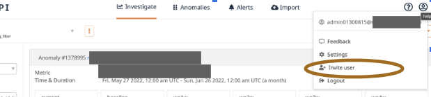
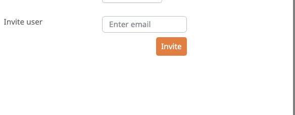
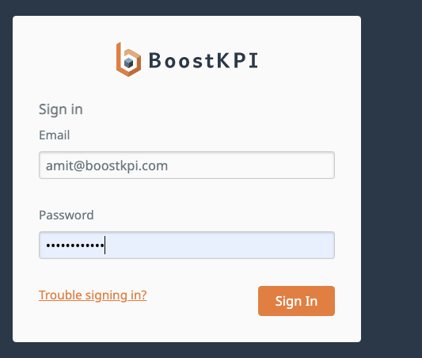

# Account management
{: .no_toc }

## Table of contents
{: .no_toc .text-delta }

1. TOC
{:toc}

### Invite users

You can invite users by clicking on settings > invite users.

Once you click on invite users, type in the email address one-at-a-time, and click invite. The users
should receive an email invitation. You can only invite users who share the same domain as you. If
your email address is x@foo.com, you can invite any email user with a foo.com domain.

### Resetting password

For changing the password, please logout and when you see the login screen, hit "trouble signing
in". It will take you to the reset password workflow (screenshots below).

