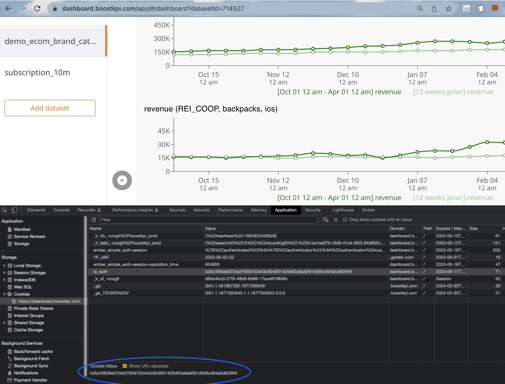

# API **(EXPERIMENTAL)**
{: .no_toc }

## Table of contents
{: .no_toc .text-delta }

1. TOC
{:toc}

## How can I fetch anomalies through the API?

BoostKPI provides programmatic access to anomalies. They can be fetched via a GET request to the following endpoint `dashboard.boostkpi.com/api/anomalies/json`.

The endpoint supports the following query parameters:

- `anomalyWindowStart` and `anomalyWindowEnd` - Returns anomalies whose duration overlap the provided window, inclusive on the start and exclusive on the end. The timestamps should be provided in milliseconds form, e.g., `Sun Jan 01 2023 00:00:00` is `1672531200000`.
- `createTimeStart` and `createTimeEnd` - Returns anomalies that were created between the two timestamps, inclusive on the start and exclusive on the end. The timestamps should be provided in milliseconds form, e.g., `Sun Jan 01 2023 00:00:00` is `1672531200000`.
- `anomalyIds` - Returns only the anomalies with the provided ids. The ids should be provided as a comma delimited list of anomaly ids, e.g., `1,2,3`.

At least one of the filters is required.

Anomalies are returned grouped by detection in the following json format:

```json5
[
  {
    // The name of the detection
    alertName: "foo", 
    // The kpi the detection watches
    kpi: "kpi1", 
    // A brief description of the detection's behavior
    desc: "Detects changes in kpi1", 
    anomalies: [
      {
        // The id of the anomaly
        id: 1, 
        // The timestamp when the anomaly began
        start: 1672531200000,
        // The timestamp when the anomaly ended 
        end: 1672617600000,
        // The type of the anomaly 
        type: "DEVIATION",
        // The value of the kpi during the anomaly 
        current: 100, 
        // The expected baseline kpi value
        baseline: 200,
        // The dimension slice that the anomaly occurred in 
        dimensions: { 
          // Name of the dimension, e.g., platform, country, etc.
          dimension_name: [ 
            // Value of the dimension, e.g., iOS, US, etc.
            "dimension_value" 
          ]
        }
      },
      {
        id: 2,
        ...
      },
      ...
    ]
  },
  {
    alertName: "bar",
    kpi: "kpi1",
    ...
  },
  {
    alertName: "baz",
    kpi: "kpi2",
    ...
  },
  ...
]
```

## How can I fetch the drilldown data through the API?

The data in the drilldown table can be fetched by a GET request to 'dashboard.boostkpi.com/api/dashboard/summary/autoDimensionOrder'.

The endpoint has the following required query parameters:

- 'metricId' - the metric id, this can be found in the url by opening an investigation of the metric
- 'currentStart' and 'currentEnd' - the investigation time range endpoints in milliseconds, takes an inclusive start and an exclusive end
- 'baselineStart' and 'baselineEnd' - the comparison time range endpoints in milliseconds, takes an inclusive start and an exclusive end
- 'summarySize' - controls the analysis complexity, a higher number will take longer to return, we recommend using 25

The endpoint supports the following optional query parameters:

- 'depth' - the number of dimensions to breakdown by (default value: 3)
- 'includedDimensions' - dimensions to use in the breakdown (defaults to an automated dimensional analysis and selection)
- 'excludedDimensions' - dimensions to exclude as options from the automated analysis and selection

The endpoint will respond with data in the following json format:

```json5
{
  // The id of the dataset for the provided metric
  datasetId: 2,
  // The metric id from the request 
  metricId: 1, 
  // Total metric value during the current time range
  currentTotal: 100, 
  // Total metric value during the baseline time range
  baselineTotal: 150,
  // The dimensions the summary information will be broken down by, comes either from automatic 
  //  analysis or the query param in the request 
  dimensions: [ 
    "dim1",
    "dim2",
    "dim3"
  ],
  responseRows: [
    {
      currentValue: 20,
      baselineValue: 30,
      percentageChange: "-33.333%",
      contributionChange: "5%",
      contributionToOverallChange: "10%",
      // The dimension values for this row
      names: [ 
        "foo", // Dimension values match in order with the dimensions
        "(ALL)", // "ALL" represents that the summary rolled up the row along this dimension
        "(ALL)-" // "(ALL)-" represents all of the values not present in any other row, 
                  // e.g., it might represent the rollup of a long tail of dimension values
      ],
      // The dimension values for any "(ALL)-" entries in the row, may be 
      // blank or incomplete for dimensions with high numbers of values
      otherDimensionValues: [ 
        "bar",
        "baz"
      ],
      // An estimate of the importance of the change in a row, higher is more important
      cost: 1000 
    },
    ...
  ],
  gainer: [
    ... // A summary of the cost for high importance single dimension values
  ],
  loser: [
    ...
  ],
  // Costs associated with including particular dimensions in the summary, 
  //  higher is more important
  dimensionCost: [ 
    {
      dimensionName: "dim1",
      cost: 1000
    },
    ...
  ]
}
```

## How can I fetch the overview or heatmap data through the API?

The data in the overview or heatmap table can be fetched by a POST request to 'dashboard.boostkpi.com/api/rootcause/metric/breakdown'.

The request should have a json body containing:

```json5
{
  metric: {
    // The id of the metric, this can be found in the url for an investigation of the metric
    id: 1, 
    // Optional dimension filters to use
    dims: [ 
      {
        // The dimension name to filter
        label: "country", 
        // Can be an include or an exclude filter
        included: [ 
          // The dimension values to filter
          "US", "CA", ... 
        ]
      },
      ...
      {
        label: "platform",
        excluded: [
          "iOS"
        ]
      }
    ]
  },
  // The inclusive start of the investigation range as a timestamp 
  //  in milliseconds, this timestamp is May 1st, 2023
  start: 1682899200000, 
  // The exclusive end of the investigation range as a timestamp 
  //  in milliseconds, this timestamp is May 7th, 2023
  end: 1683417600000, 
  // A string representing the offset for comparison: "wo1w" to compare to the previous week, 
  //  "mo3m" to compare to three months prior, "do1d" to compare to the previous day
  offset: "wo1w", 
  // The number of top dimension values to return for each dimension, 
  //  values past the limit will be rolled up into other
  limit: 50 
}
```

The endpoint will respond with breakdown data in the following json format:

```json5
{
  result_complete: {
    dimension_name1: {
      dimension_value1: {
        // The metric value for dimension_value1 during the start to end time range
        current: 10, 
        // The metric value for dimension_value1 during the offset comparison time range
        offset: 8 
      },
      ...
      dimension_value50: {
        current: 1,
        offset: 2
      }
    },
    dimension_name2: {
      ...
    },
    ...
  },
  // The overall metric totals, these values can be used to compute the tail 
  //  metric values past the requested limit
  totals: { 
    // The value of the metric between the start and end time
    current: 100, 
    // The value of the metric during the offset comparison time range
    offset: 90 
  },
  // An id for internal BoostKPI use
  performanceId: 1 
}
```


## How do I authenticate when using the API?

To authenticate to BoostKPI, grab your te_auth cookie while logged into dashboard.boostkpi.com and include it with any requests. See screenshot below on how to grab the te_auth cookie.
 

With the cookie set, here is an example request using the tool curl that can be executed on a Mac Terminal.

```
curl 
--cookie te_auth=665ceb3c7272adddfa9f54fd603a6ebed0033a4b5b8391344ab47e756dd59935 
https://dashboard.boostkpi.com/api/anomalies/json\?anomalyWindowStart\=1683717689000\&anomalyWindowEnd\=1683917689000
```


