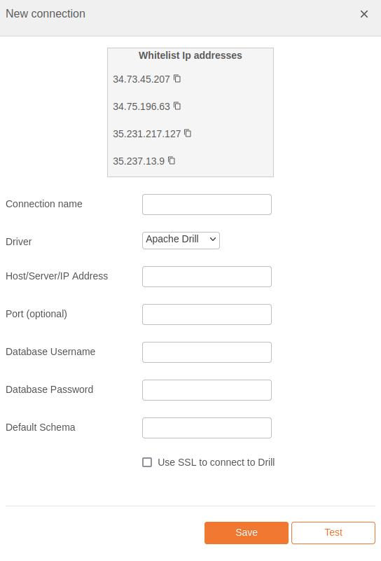

# Apache Drill Integration Documentation

## Table of Parameters

| Key               | Description                                          | Optional | Data Type |
|-------------------|------------------------------------------------------|----------|-----------|
| `Connection name` | A user-defined name for the connection.              |          | Text      |
| `Host`            | Hostname or IP address of the Apache Drill instance. |          | Text      |
| `Port`            | Port number on which Apache Drill is running.        | Yes      | Number    |
| `Username`        | Username for authentication.                         |          | Text      |
| `Password`        | Password for authentication.                         |          | Text      |
| `Default schema`  | Default schema for queries.                          |          | Text      |
| `Use SSL`         | Enable or disable SSL encryption.                    | Yes      | Boolean   |

## Setup Information

To integrate Apache Drill with our system, follow these steps:

1. **Select the Apache Drill Connector:** Select the Apache Drill connector on import page
   in `Connection` modal.

2. **Configure Connection Parameters:** Use the parameters listed above to configure the connection
   to your Apache Drill instance.

3. **Verify Connection:** After configuring the parameters, verify the connection to ensure
   successful integration.

## Connection modal

## Additional Documentation

For more details and advanced configurations, refer to the
official [Apache Drill Documentation](https://drill.apache.org/docs/).

## Support

If you encounter any issues or have questions, please contact our support team.
