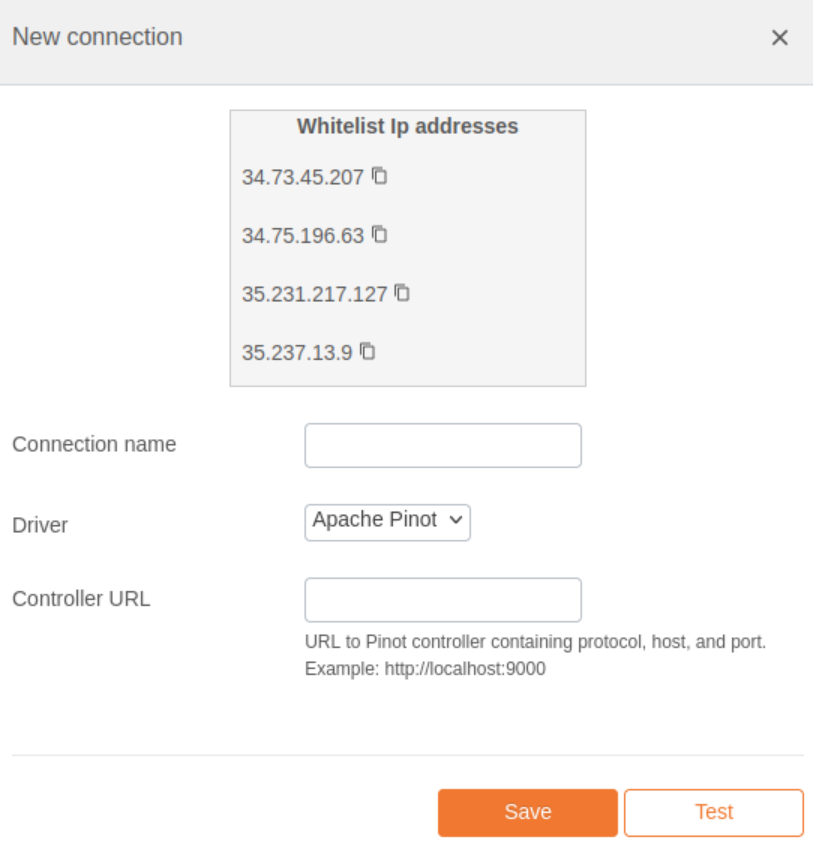

# Apache Pinot Integration Documentation

## Table of Parameters

| Key               | Description                                         | Optional | Data Type |
|-------------------|-----------------------------------------------------|----------|-----------|
| `Connection name` | A user-defined name for the connection.             |          | Text      |
| `Controller URL`  | URL to Pinot controller containing protocol, host, and port.|          | Text      |

## Setup Information

To integrate Apache Pinot with our system, follow these steps:

1. **Select the Apache Pinot Connector:** Select the Apache Pinot connector on import page in `Connection` modal.

2. **Configure Connection Parameters:** Use the parameters listed above to configure the connection to your Apache Pinot instance.

3. **Verify Connection:** After configuring the parameters, verify the connection to ensure successful integration.

## Connection modal

## Additional Documentation

For more details and advanced configurations, refer to the official [Apache Pinot Documentation](https://docs.pinot.apache.org/).

## Support

If you encounter any issues or have questions, please contact our support team.