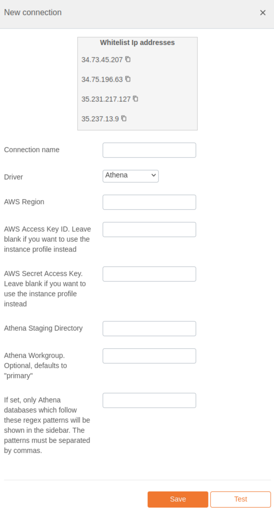

# Amazon Athena Integration Documentation

## Table of Parameters

| Key                        | Description                                                             | Optional | Data Type |
|----------------------------|-------------------------------------------------------------------------|----------|-----------|
| `connection_name`          | A user-defined name for the connection.                                 |          | Text      |
| `driver`                   | Must be set to 'athena'.                                                |          | Text      |
| `aws_region`               | AWS region where Athena is deployed.                                    |          | Text      |
| `aws_access_key_id`        | AWS Access Key ID. Leave blank for instance profile authentication.     | Yes      | Text      |
| `aws_secret_access_key`    | AWS Secret Access Key. Leave blank for instance profile authentication. | Yes      | Text      |
| `athena_staging_directory` | Athena staging directory in S3.                                         |          | Text      |
| `athena_workgroup`         | Athena workgroup (optional, defaults to 'primary').                     | Yes      | Text      |
| `database_patterns`        | Regex patterns for Athena databases (comma-separated).                  | Yes      | Text      |

## Setup Information

To integrate Athena with our system, follow these steps:

1. **Select the Athena Connector:** Select the Athena connector on import page in `Connection`
   modal.

2. **Configure Connection Parameters:** Use the parameters listed above to configure the connection
   to your Athena instance.

3. **Verify Connection:** After configuring the parameters, verify the connection to ensure
   successful integration.

## Connection modal

## Additional Documentation

For more details and advanced configurations, refer to the
official [Athena Documentation](https://docs.aws.amazon.com/athena/).

## Support

If you encounter any issues or have questions, please contact our support team.