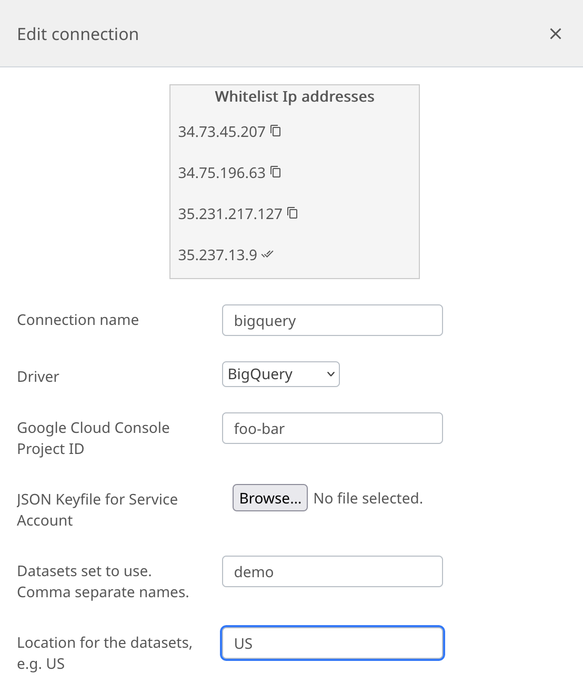

# Google BigQuery Integration Documentation

## Table of Parameters

| Key                | Description                             | Optional | Data Type |
|--------------------|-----------------------------------------|----------|-----------|
| `connection_name`  | A user-defined name for the connection. |          | Text      |
| `driver`           | Must be set to 'bigquery'.              |          | Text      |
| `project_id`       | Project ID for BigQuery.                |          | Text      |
| `key_file`         | JSON keyfile for service account.       |          | Text      |
| `dataset_name`     | Dataset to use in BigQuery.             |          | Text      |
| `dataset_location` | Location for this dataset in BigQuery.  |          | Text      |

## Setup Information

To integrate BigQuery with our system, follow these steps:

1. **Select the BigQuery Connector:** Select the BigQuery connector on import page in `Connection` modal.

2. **Configure Connection Parameters:** Use the parameters listed above to configure the connection to your BigQuery
   instance.

   It is easy to connect BoostKPI to your BigQuery account. Enter the JSON keyfile for a service account in your BoostKPI dashboard (as shown in the image below). See [Granting BoostKPI access to your BigQuery tables](#granting-boostkpi-access-to-your-bigquery-tables) for details on how to generate a JSON keyfile.
   

3. **Verify Connection:** After configuring the parameters, verify the connection to ensure successful integration.

## Granting BoostKPI access to your BigQuery tables

BoostKPI uses a [service account](https://cloud.google.com/compute/docs/access/service-accounts) to connect to your data stored in BigQuery. A GCP service account is a type of Google account that can securely communicate over Google APIs on your behalf.  You need to have the [permission to create a service account](https://cloud.google.com/iam/docs/creating-managing-service-accounts#permissions) on your Google Cloud project. After you create the account, please generate a json private key for your BigQuery instance.

Here are the steps to create a service account and obtain the JSON key:

1. Login to your GCP console
2. Open the Navigation menu
3. Hover over __IAM & Admin__ and select __Service Accounts__ from the submenu
4. Click __+ CREATE SERVICE ACCOUNT__ link in the service accounts header
5. Under Service account details, add an account name, ID, and an optional description
6. Click __CREATE__
7. Under Service account permissions, add the following roles (you can search for the roles):
- *BigQuery Data Viewer*
- *BigQuery Job User*
8. Click __CONTINUE__
9. You will see the service account in the *service account* list view.
10. Select the account, click __ACTIONS__, followed by __+ CREATE KEY__ to create a json private key

A file will be downloaded to your computer, which you can upload in your BoostKPI dashboard (*Import* > *Connections* > *Add Connection*)

## Additional Documentation

For more details and advanced configurations, refer to the
official [BigQuery Documentation](https://cloud.google.com/bigquery/docs).

## Support

If you encounter any issues or have questions, please contact our support team.
