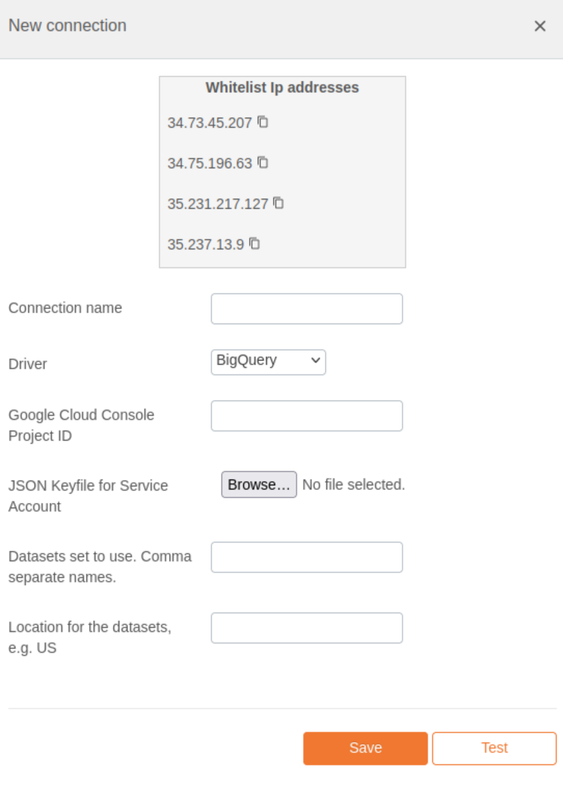

# Google BigQuery Integration Documentation

## Table of Parameters

| Key                | Description                             | Optional | Data Type |
|--------------------|-----------------------------------------|----------|-----------|
| `connection_name`  | A user-defined name for the connection. |          | Text      |
| `driver`           | Must be set to 'bigquery'.              |          | Text      |
| `project_id`       | Project ID for BigQuery.                |          | Text      |
| `key_file`         | JSON keyfile for service account.       |          | Text      |
| `dataset_name`     | Dataset to use in BigQuery.             |          | Text      |
| `dataset_location` | Location for this dataset in BigQuery.  |          | Text      |

## Setup Information

To integrate BigQuery with our system, follow these steps:

1. **Select the BigQuery Connector:** Select the BigQuery connector on import page in `Connection` modal.

2. **Configure Connection Parameters:** Use the parameters listed above to configure the connection to your BigQuery
   instance.

3. **Verify Connection:** After configuring the parameters, verify the connection to ensure successful integration.

## Connection modal

## Additional Documentation

For more details and advanced configurations, refer to the
official [BigQuery Documentation](https://cloud.google.com/bigquery/docs).

## Support

If you encounter any issues or have questions, please contact our support team.