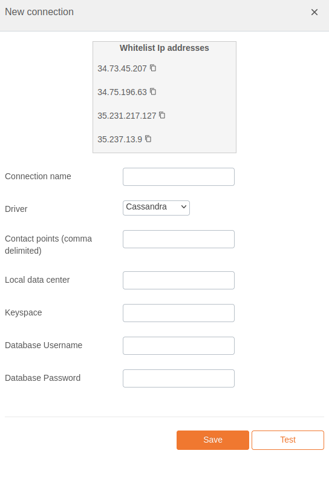

# Cassandra Integration Documentation

## Table of Parameters

| Key                 | Description                             | Optional | Data Type |
|---------------------|-----------------------------------------|----------|-----------|
| `name`              | Name of connection                      |          | text      |
| `driver`            | Must be cassandra                       |          | text      |
| `contact points`    | Contact points (comma delimited)        |          | text      |
| `local data center` | Local data center                       |          | text      |
| `keyspace`          | Keyspace                                |          | text      |
| `DB username`       | Connection username                     |          | text      |
| `DB password`       | Connection password                     |          | text      |

## Setup Information

To integrate Cassandra with our system, follow these steps:

1. **Select the Cassandra Connector:** Select the Cassandra connector on import page in `Connection`
   modal.

2. **Configure Connection Parameters:** Use the parameters listed above to configure the connection
   to your Cassandra instance.

3. **Verify Connection:** After configuring the parameters, verify the connection to ensure
   successful integration.

## Connection modal

## Additional Documentation

For more details and advanced configurations, refer to the
official [Cassandra Documentation](https://cassandra.apache.org/doc/latest/).

## Support

If you encounter any issues or have questions, please contact our support team.