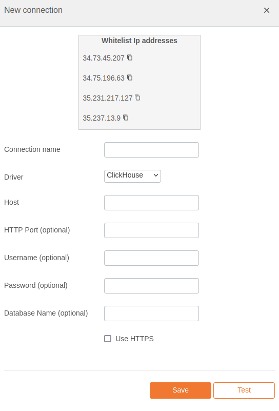

# ClickHouse Integration Documentation

## Table of Parameters

| Key        | Description            | Optional | Data Type |
|------------|------------------------|----------|-----------|
| `name`     | Name of connection     |          | text      |
| `driver`   | Must be clickhouse     |          | text      |
| `host`     | Host/Server/IP Address |          | text      |
| `port`     | HTTP Port              | Yes      | number    |
| `username` | Username               | Yes      | text      |
| `password` | Password               | Yes      | text      |
| `database` | Database Name          | Yes      | text      |

## Setup Information

To integrate ClickHouse with our system, follow these steps:

1. **Select the ClickHouse Connector:** Select the ClickHouse connector on import page
   in `Connection` modal.

2. **Configure Connection Parameters:** Use the parameters listed above to configure the connection
   to your ClickHouse
   instance.

3. **Verify Connection:** After configuring the parameters, verify the connection to ensure
   successful integration.

## Connection modal

## Additional Documentation

For more details and advanced configurations, refer to the
official [ClickHouse Documentation](https://clickhouse.com/docs/en/intro).

## Support

If you encounter any issues or have questions, please contact our support team.
