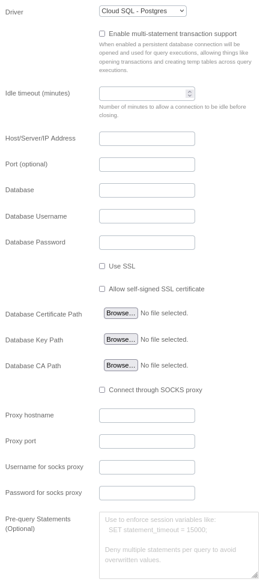
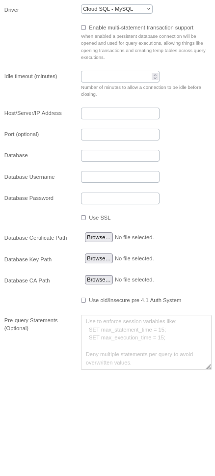
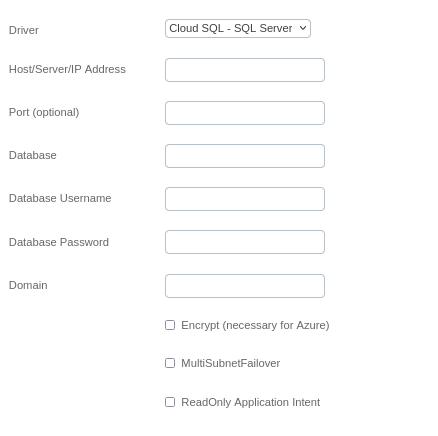

# Cloud SQL Integration Documentation

## Integration Overview

This guide provides step-by-step instructions on how to integrate Cloud SQL databases
with BoostKPI for comprehensive data analysis and reporting. Whether you're using PostgreSQL, MySQL,
or SQL Server on Google Cloud Platform's Cloud SQL service, this documentation will walk you through
the process of setting up and configuring your database connections within BoostKPI.

## Setup Information

To integrate Cloud SQL with our system, follow these steps:

1. **Select the appropriate Connector:** Choose the respective database connector (PostgreSQL,
   MySQL, or SQL Server) on the import page in the `Connection` modal.

2. **Configure Connection Parameters:** Use the parameters listed below to configure the connection
   to your Cloud SQL instance.

3. **Verify Connection:** After configuring the parameters, verify the connection to ensure
   successful integration.

## PostgreSQL

### Table of Parameters

| Key                                | Description                                           | Optional | Data Type |
|------------------------------------|-------------------------------------------------------|----------|-----------|
| `name`                             | Name of connection                                    |          | text      |
| `driver`                           | Must be postgres                                      |          | text      |
| `multiStatementTransactionEnabled` | Reuse db connection across query executions           |          | boolean   |
| `idleTimeoutSeconds`               | Seconds to allow connection to be idle before closing |          | number    |
| `queryTimeout`                     | Seconds to allow any query to run before cancelling   |          | number    |
| `host`                             | Host/Server/IP Address                                |          | text      |
| `port`                             | Port                                                  | Yes      | text      |
| `database`                         | Database                                              |          | text      |
| `username`                         | Database Username                                     |          | text      |
| `password`                         | Database Password                                     |          | text      |
| `postgresSsl`                      | Use SSL                                               | Yes      | boolean   |
| `postgresSslSelfSigned`            | Allow self-signed SSL certificate                     | Yes      | boolean   |
| `postgresCert`                     | Database Certificate Path                             | Yes      | text      |
| `postgresKey`                      | Database Key Path                                     | Yes      | text      |
| `postgresCA`                       | Database CA Path                                      | Yes      | text      |
| `useSocks`                         | Connect through SOCKS proxy                           | Yes      | boolean   |
| `socksHost`                        | Proxy hostname                                        | Yes      | text      |
| `socksPort`                        | Proxy port                                            | Yes      | text      |
| `socksUsername`                    | Username for socks proxy                              | Yes      | text      |
| `socksPassword`                    | Password for socks proxy                              | Yes      | text      |

### Connection modal

## MySQL

### Table of Parameters

| Key                                | Description                                                                                                                                                                                                                         | Optional | Data Type |
|------------------------------------|-------------------------------------------------------------------------------------------------------------------------------------------------------------------------------------------------------------------------------------|----------|-----------|
| `name`                             | Name of connection                                                                                                                                                                                                                  |          | text      |
| `driver`                           | Must be mysql                                                                                                                                                                                                                       |          | text      |
| `multiStatementTransactionEnabled` | Reuse db connection across query executions. When enabled a persistent database connection will be opened and used for query executions, allowing things like opening transactions and creating temp tables across query executions | Yes      | boolean   |
| `Idle timeout`                     | Number of minutes to allow a connection to be idle before closing.                                                                                                                                                                  |          | boolean   |
| `host`                             | Host/Server/IP Address                                                                                                                                                                                                              |          | text      |
| `port`                             | Port                                                                                                                                                                                                                                | Yes      | number    |
| `Database Certificate`             | Database certificate for SSL configuration                                                                                                                                                                                          | Yes      | cert      |
| `Database Key`                     | Database key certificate for SSL configuration                                                                                                                                                                                      | Yes      | cert      |
| `Database CA`                      | Database CA certificate for SSL configuration                                                                                                                                                                                       | Yes      | cert      |
| `database`                         | Database                                                                                                                                                                                                                            |          | text      |
| `username`                         | Database Username                                                                                                                                                                                                                   |          | text      |
| `password`                         | Database Password                                                                                                                                                                                                                   |          | text      |
| `mysqlSsl`                         | Use SSL                                                                                                                                                                                                                             | Yes      | boolean   |
| `mysqlInsecureAuth`                | Use old/insecure pre 4.1 Auth System                                                                                                                                                                                                | Yes      | boolean   |

### Connection modal

## SQL Server

### Table of Parameters

| Key                            | Description                   | Optional | Data Type |
|--------------------------------|-------------------------------|----------|-----------|
| `name`                         | Name of connection            |          | text      |
| `driver`                       | Must be sqlserver             |          | text      |
| `host`                         | Host/Server/IP Address        |          | text      |
| `port`                         | Port                          | Yes      | text      |
| `database`                     | Database                      |          | text      |
| `username`                     | Database Username             |          | text      |
| `password`                     | Database Password             |          | text      |
| `domain`                       | Domain                        |          | text      |
| `sqlserverEncrypt`             | Encrypt (necessary for Azure) | Yes      | boolean   |
| `sqlserverMultiSubnetFailover` | MultiSubnetFailover           | Yes      | boolean   |
| `readOnlyIntent`               | ReadOnly Application Intent   | Yes      | boolean   |

### Connection modal

## Additional Documentation

For more details and advanced configurations, refer to the official documentation for each database
type:

- [PostgreSQL Documentation](https://www.postgresql.org/docs/)
- [MySQL Documentation](https://dev.mysql.com/doc/)
- [SQL Server Documentation](https://learn.microsoft.com/en-us/sql/?view=sql-server-ver16)

## Support

If you encounter any issues or have questions, please contact our support team.
