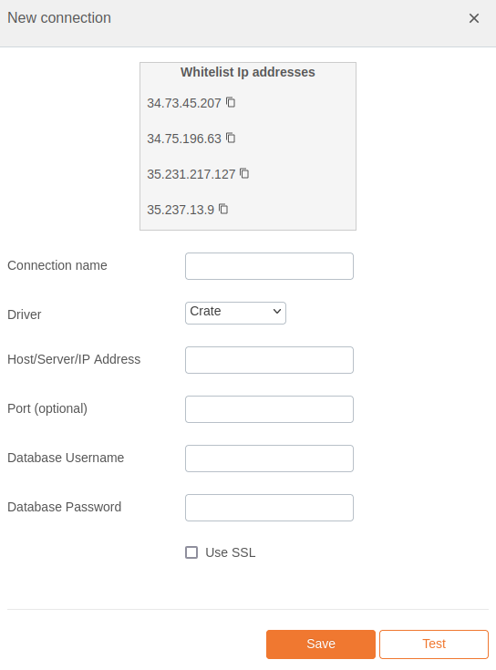

# CrateDB Integration Documentation

## Table of Parameters

| Key        | Description            | Optional | Data Type |
|------------|------------------------|----------|-----------|
| `name`     | Name of connection     |          | text      |
| `driver`   | Must be crate          |          | text      |
| `host`     | Host/Server/IP Address |          | text      |
| `port`     | Port                   | Yes      | number    |
| `username` | Database Username      |          | text      |
| `password` | Database Password      |          | text      |
| `ssl`      | Use SSL                | Yes      | boolean   |

## Setup Information

To integrate CrateDB with our system, follow these steps:

1. **Select the CrateDB Connector:** Select the CrateDB connector on import page in `Connection`
   modal.

2. **Configure Connection Parameters:** Use the parameters listed above to configure the connection
   to your CrateDB instance.

3. **Verify Connection:** After configuring the parameters, verify the connection to ensure
   successful integration.

## Connection modal

## Additional Documentation

For more details and advanced configurations, refer to the
official [CrateDB Documentation](https://docs.crate.io/).

## Support

If you encounter any issues or have questions, please contact our support team.
