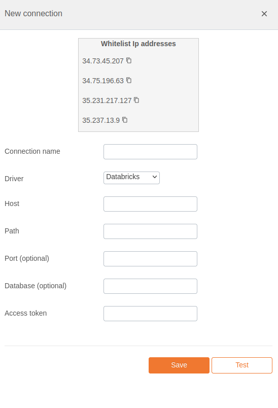

# Databricks Integration Documentation

## Table of Parameters

| Key           | Description            | Optional | Data Type |
|---------------|------------------------|----------|-----------|
| `name`        | Name of connection     |          | text      |
| `driver`      | Must be databricks     |          | text      |
| `host`        | Host/Server/IP Address |          | text      |
| `path`        | Path                   |          | text      |
| `port`        | Port                   | Yes      | number    |
| `database`    | Database name          | Yes      | text      |
| `accessToken` | Access token           |          | text      |

## Setup Information

To integrate Databricks with our system, follow these steps:

1. **Select the Databricks Connector:** Select the Databricks connector on import page
   in `Connection` modal.

2. **Configure Connection Parameters:** Use the parameters listed above to configure the connection
   to your Databricks instance.

3. **Verify Connection:** After configuring the parameters, verify the connection to ensure
   successful integration.

## Connection modal

## Additional Documentation

For more details and advanced configurations, refer to the
official [Databricks Documentation](https://docs.databricks.com/en/index.html).

## Support

If you encounter any issues or have questions, please contact our support team.
