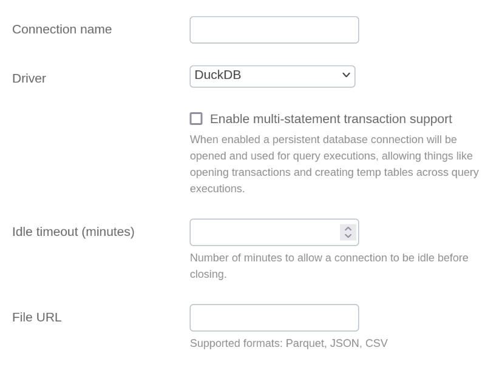

# DuckDB Integration Documentation

## Table of parameters

| Key                                | Description                                              | Optional | Data Type |
|------------------------------------|----------------------------------------------------------|----------|-----------|
| `name`                             | Name of connection                                       |          | text      |
| `driver`                           | Must be set to DuckDB                                    |          | text      |
| `multiStatementTransactionEnabled` | Reuse db connection across query executions              |          | boolean   |
| `idleTimeoutSeconds`               | Seconds to allow connection to be idle before closing    |          | number    |
| `fileUrl`                          | URL link to the data file (supports: CSV, JSON, Parquet) |          | text      |

## Setup Information

To import data from DuckDB to our system, follow these steps:

1. **Select the DuckDB Connector:** Select the AlloyDB connector on import page in `Connection`
   modal.

2. **Configure Connection Parameters:** Use the parameters listed above to configure the connection to your DuckDB
   instance. For improved security, it is strongly suggested to use presigned URLs for data import.

3. **Verify Connection:** After configuring the parameters, verify the connection to ensure
   successful integration.

## Connection modal

## Additional Documentation

For more details and advanced configurations, refer to the
official [DuckDB Documentation](https://duckdb.org/docs/).

## Support

If you encounter any issues or have questions, please contact our support team.

**Note:** BoostKPI currently supports only **one-off** data import from DuckDB. Scheduled imports are not available at the
moment.