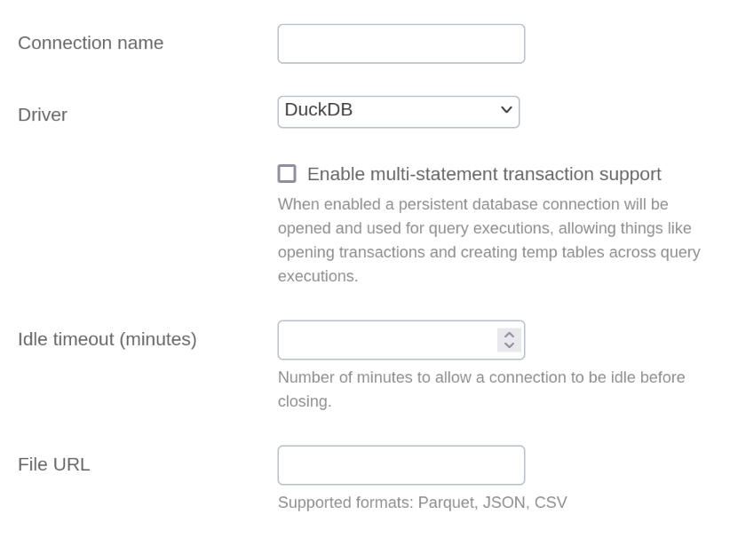

# DuckDB Integration Documentation

## Table of parameters

| Key                                | Description                                              | Optional | Data Type |
|------------------------------------|----------------------------------------------------------|----------|-----------|
| `name`                             | Name of connection                                       |          | text      |
| `driver`                           | Must be set to DuckDB                                    |          | text      |
| `multiStatementTransactionEnabled` | Reuse db connection across query executions              |          | boolean   |
| `idleTimeoutSeconds`               | Seconds to allow connection to be idle before closing    |          | number    |
| `fileUrl`                          | URL link to the data file (supports: CSV, JSON, Parquet) |          | text      |

## Setup Information

To import data from DuckDB to our system, follow these steps:

1. **Upload your data file to your storage provider** (Example: S3 file upload)
   1. Click on **Upload** button
   2. Click on **Add files** button
   3. Select your data file and confirm the dialog 
   4. Validate uploaded file configuration and click on **Upload** button 
   5. Wait for the upload to finish and validate it's success
   6. Open the destination bucket, then uploaded file page and copy the file URL
   
   <video autoplay="autoplay" loop="loop" width="768" height="512" muted>
     <source src="../../../images/integration/duckdb/Parquet_S3_Upload.webm" type="video/webm">
   </video>

2. **Select the DuckDB Connector:** Select the DuckDB connector on import page in `Connection`
   modal.

3. **Configure Connection Parameters:** Use the parameters listed above to configure the connection to your DuckDB
   instance. For improved security, it is strongly suggested to use presigned URLs for data import.

   Presigned URL is required if the storage is private. Any presigned URL will work. As an example, the file can be
   uploaded to Google Cloud Storage, AWS S3 or Azure Storage:

   <video autoplay="autoplay" loop="loop" width="768" height="512" muted>
     <source src="../../../images/integration/duckdb/S3_Create_Presigned_URL_compressed.webm" type="video/webm">
   </video>

4. **Verify Connection:** After configuring the parameters, verify the connection to ensure
   successful integration.

   <video autoplay="autoplay" loop="loop" width="768" height="512" muted>
     <source src="../../../images/integration/duckdb/Connect_Parquet_compressed.webm" type="video/webm">
   </video>

## Connection modal

## Additional Documentation

For more details and advanced configurations, refer to the
official [DuckDB Documentation](https://duckdb.org/docs/).

## Support

If you encounter any issues or have questions, please contact our support team.

**Note:** BoostKPI currently supports only **one-off** data import from DuckDB. Scheduled imports are not available at the
moment.