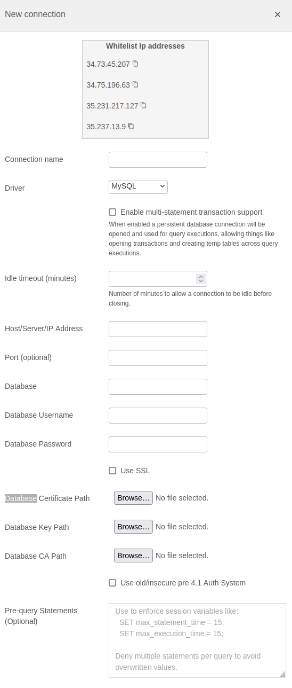

# MySQL Integration Documentation

## Table of Parameters

| Key                                | Description                                                                                                                                                                                                                         | Optional | Data Type |
|------------------------------------|-------------------------------------------------------------------------------------------------------------------------------------------------------------------------------------------------------------------------------------|----------|-----------|
| `name`                             | Name of connection                                                                                                                                                                                                                  |          | text      |
| `driver`                           | Must be mysql                                                                                                                                                                                                                       |          | text      |
| `multiStatementTransactionEnabled` | Reuse db connection across query executions. When enabled a persistent database connection will be opened and used for query executions, allowing things like opening transactions and creating temp tables across query executions | Yes      | boolean   |
| `Idle timeout`                     | Number of minutes to allow a connection to be idle before closing.                                                                                                                                                                  |          | boolean   |
| `host`                             | Host/Server/IP Address                                                                                                                                                                                                              |          | text      |
| `port`                             | Port                                                                                                                                                                                                                                | Yes      | number    |
| `Database Certificate`             | Database certificate for SSL configuration                                                                                                                                                                                          | Yes      | cert      |
| `Database Key`                     | Database key certificate for SSL configuration                                                                                                                                                                                      | Yes      | cert      |
| `Database CA`                      | Database CA certificate for SSL configuration                                                                                                                                                                                       | Yes      | cert      |
| `database`                         | Database                                                                                                                                                                                                                            |          | text      |
| `username`                         | Database Username                                                                                                                                                                                                                   |          | text      |
| `password`                         | Database Password                                                                                                                                                                                                                   |          | text      |
| `mysqlSsl`                         | Use SSL                                                                                                                                                                                                                             | Yes      | boolean   |
| `mysqlInsecureAuth`                | Use old/insecure pre 4.1 Auth System                                                                                                                                                                                                | Yes      | boolean   |

## Setup Information

To integrate MySQL with our system, follow these steps:

1. **Select the MySQL Connector:** Select the MySQL connector on import page in `Connection`
   modal.

2. **Configure Connection Parameters:** Use the parameters listed above to configure the connection
   to your MySQL instance.

3. **Verify Connection:** After configuring the parameters, verify the connection to ensure
   successful integration.

## Connection modal

## Additional Documentation

For more details and advanced configurations, refer to the
official [MySQL Documentation](https://dev.mysql.com/doc/).

## Support

If you encounter any issues or have questions, please contact our support team.
