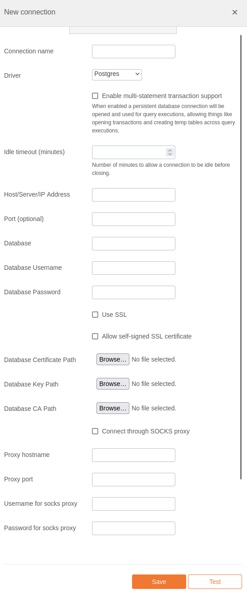

# PostgreSQL Integration Documentation

## Table of Parameters

| Key                                | Description                                           | Optional | Data Type |
|------------------------------------|-------------------------------------------------------|----------|-----------|
| `name`                             | Name of connection                                    |          | text      |
| `driver`                           | Must be postgres                                      |          | text      |
| `multiStatementTransactionEnabled` | Reuse db connection across query executions           |          | boolean   |
| `idleTimeoutSeconds`               | Seconds to allow connection to be idle before closing |          | number    |
| `queryTimeout`                     | Seconds to allow any query to run before cancelling   |          | number    |
| `host`                             | Host/Server/IP Address                                |          | text      |
| `port`                             | Port                                                  | Yes      | text      |
| `database`                         | Database                                              |          | text      |
| `username`                         | Database Username                                     |          | text      |
| `password`                         | Database Password                                     |          | text      |
| `postgresSsl`                      | Use SSL                                               | Yes      | boolean   |
| `postgresSslSelfSigned`            | Allow self-signed SSL certificate                     | Yes      | boolean   |
| `postgresCert`                     | Database Certificate Path                             | Yes      | text      |
| `postgresKey`                      | Database Key Path                                     | Yes      | text      |
| `postgresCA`                       | Database CA Path                                      | Yes      | text      |
| `useSocks`                         | Connect through SOCKS proxy                           | Yes      | boolean   |
| `socksHost`                        | Proxy hostname                                        | Yes      | text      |
| `socksPort`                        | Proxy port                                            | Yes      | text      |
| `socksUsername`                    | Username for socks proxy                              | Yes      | text      |
| `socksPassword`                    | Password for socks proxy                              | Yes      | text      |

## Setup Information

To integrate PostgreSQL with our system, follow these steps:

1. **Select the PostgreSQL Connector:** Select the PostgreSQL connector on import page
   in `Connection` modal.

2. **Configure Connection Parameters:** Use the parameters listed above to configure the connection
   to your PostgreSQL instance.

3. **Verify Connection:** After configuring the parameters, verify the connection to ensure
   successful integration.

## Connection modal

## Additional Documentation

For more details and advanced configurations, refer to the
official [PostgreSQL Documentation](https://www.postgresql.org/docs/).

## Support

If you encounter any issues or have questions, please contact our support team.