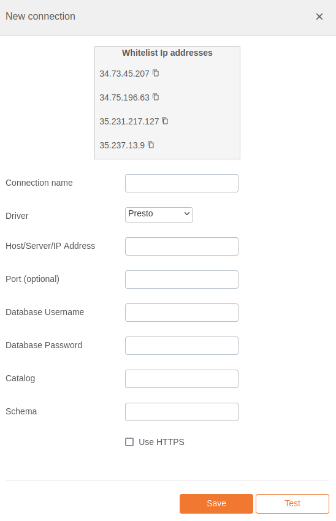

# PrestoDB Integration Documentation

## Table of Parameters

| Key             | Description            | Optional | Data Type |
|-----------------|------------------------|----------|-----------|
| `name`          | Name of connection     |          | text      |
| `driver`        | Must be presto         |          | text      |
| `host`          | Host/Server/IP Address |          | text      |
| `port`          | Port                   | Yes      | text      |
| `username`      | Database Username      |          | text      |
| `prestoCatalog` | Catalog                |          | text      |
| `prestoSchema`  | Schema                 |          | text      |

## Setup Information

To integrate PrestoDB with our system, follow these steps:

1. **Select the PrestoDB Connector:** Select the PrestoDB connector on import page in `Connection`
   modal.

2. **Configure Connection Parameters:** Use the parameters listed above to configure the connection
   to your PrestoDB instance.

3. **Verify Connection:** After configuring the parameters, verify the connection to ensure
   successful integration.

## Connection modal

## Additional Documentation

For more details and advanced configurations, refer to the
official [PrestoDB Documentation](https://prestodb.io/docs/current/overview.html).

## Support

If you encounter any issues or have questions, please contact our support team.
