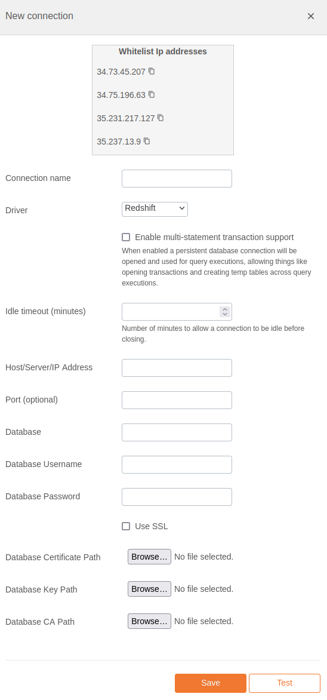

# Amazon Redshift Integration Documentation

## Table of Parameters

| Key                                | Description                                           | Optional | Data Type |
|------------------------------------|-------------------------------------------------------|----------|-----------|
| `name`                             | Name of connection                                    |          | text      |
| `driver`                           | Must be redshift                                      |          | text      |
| `multiStatementTransactionEnabled` | Reuse db connection across query executions           | Yes      | boolean   |
| `idleTimeoutSeconds`               | Seconds to allow connection to be idle before closing | Yes      | number    |
| `host`                             | Host/Server/IP Address                                |          | text      |
| `port`                             | Port                                                  | Yes      | text      |
| `database`                         | Database                                              |          | text      |
| `username`                         | Database Username                                     |          | text      |
| `password`                         | Database Password                                     |          | text      |
| `ssl`                              | Use SSL                                               | Yes      | boolean   |
| `certPath`                         | Database Certificate Path                             | Yes      | text      |
| `keyPath`                          | Database Key Path                                     | Yes      | text      |
| `caPath`                           | Database CA Path                                      | Yes      | text      |

## Setup Information

To integrate Redshift with our system, follow these steps:

1. **Select the Redshift Connector:** Select the Redshift connector on import page in `Connection`
   modal.

2. **Configure Connection Parameters:** Use the parameters listed above to configure the connection
   to your Redshift instance.

3. **Verify Connection:** After configuring the parameters, verify the connection to ensure
   successful integration.

## Connection modal

## Additional Documentation

For more details and advanced configurations, refer to the
official [Redshift Documentation](https://docs.aws.amazon.com/redshift/).

## Support

If you encounter any issues or have questions, please contact our support team.