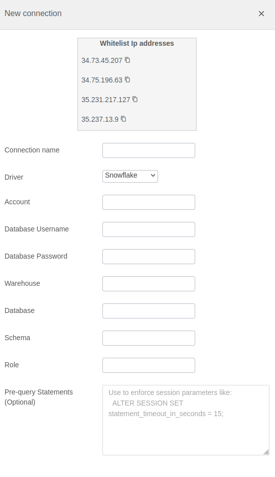

# Snowflake Integration Documentation

## Table of Parameters

| Key                    | Description                                          | Optional | Data Type |
|------------------------|------------------------------------------------------|----------|-----------|
| `name`                 | Name of connection                                   |          | text      |
| `driver`               | Must be Snowflake                                    |          | text      |
| `account`              | Database account                                     |          | text      |
| `database username`    | Username                                             |          | text      |
| `database password`    | Password                                             |          | text      |
| `warehouse`            | Database warehouse                                   |          | text      |
| `database`             | Database                                             |          | text      |
| `schema`               | Database schema                                      |          | text      |
| `role`                 | Database user role                                   |          | text      |
| `pre-query statements` | Statements triggered before running import SQL query | Yes      | text      |

## Setup Information

To integrate Snowflake with our system, follow these steps:

1. **Select the Snowflake Connector:** Select the Snowflake connector on import page in `Connection`
   modal.

2. **Configure Connection Parameters:** Use the parameters listed above to configure the connection
   to your Snowflake instance.

3. **Verify Connection:** After configuring the parameters, verify the connection to ensure
   successful integration.

## Connection modal

## Additional Documentation

For more details and advanced configurations, refer to the
official [Snowflake Documentation](https://docs.snowflake.com/).

## Support

If you encounter any issues or have questions, please contact our support team.