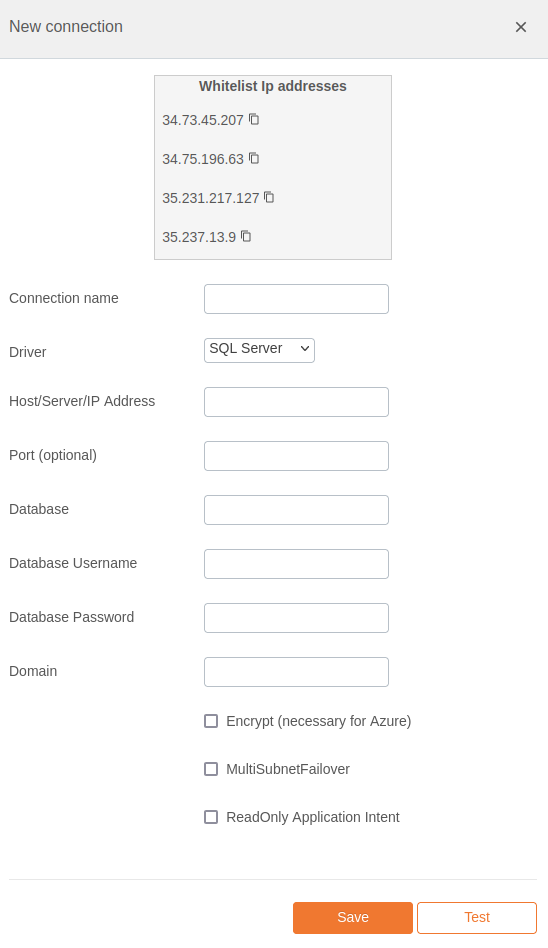

# SQL Server Integration Documentation

## Table of Parameters

| Key                            | Description                   | Optional | Data Type |
|--------------------------------|-------------------------------|----------|-----------|
| `name`                         | Name of connection            |          | text      |
| `driver`                       | Must be sqlserver             |          | text      |
| `host`                         | Host/Server/IP Address        |          | text      |
| `port`                         | Port                          | Yes      | text      |
| `database`                     | Database                      |          | text      |
| `username`                     | Database Username             |          | text      |
| `password`                     | Database Password             |          | text      |
| `domain`                       | Domain                        |          | text      |
| `sqlserverEncrypt`             | Encrypt (necessary for Azure) | Yes      | boolean   |
| `sqlserverMultiSubnetFailover` | MultiSubnetFailover           | Yes      | boolean   |
| `readOnlyIntent`               | ReadOnly Application Intent   | Yes      | boolean   |

## Setup Information

To integrate SQL Server with our system, follow these steps:

1. **Select the SQL Server Connector:** Select the SQL Server connector on import page
   in `Connection` modal.

2. **Configure Connection Parameters:** Use the parameters listed above to configure the connection
   to your SQL Server instance.

3. **Verify Connection:** After configuring the parameters, verify the connection to ensure
   successful integration.

## Connection modal

## Additional Documentation

For more details and advanced configurations, refer to the
official [SQL Server Documentation](https://learn.microsoft.com/en-us/sql/?view=sql-server-ver16).

## Support

If you encounter any issues or have questions, please contact our support team.
