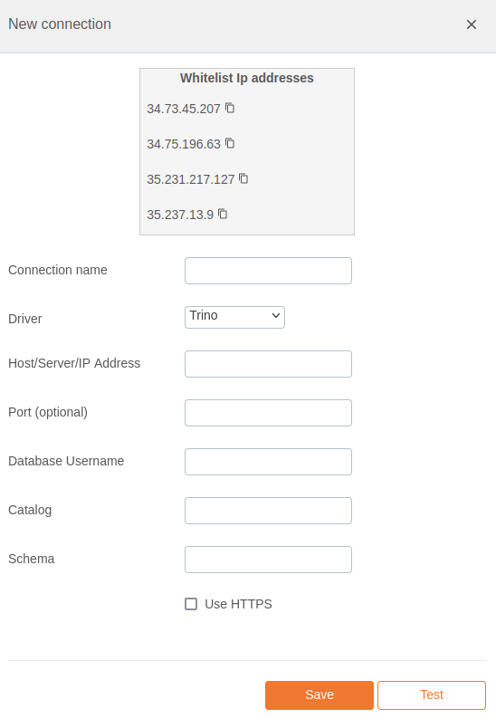

# Trino Integration Documentation

## Table of Parameters

| Key        | Description                         | Optional | Data Type |
|------------|-------------------------------------|----------|-----------|
| `name`     | Name of connection                  |          | text      |
| `driver`   | Must be trino                       |          | text      |
| `host`     | Host/Server/IP Address              |          | text      |
| `port`     | Port                                | Yes      | number    |
| `username` | Database Username                   |          | text      |
| `catalog`  | Catalog                             |          | text      |
| `schema`   | Schema                              |          | text      |
| `https`    | Use HTTPS when connection to the DB | Yes      | text      |

## Setup Information

To integrate Trino with our system, follow these steps:

1. **Select the Trino Connector:** Select the Trino connector on import page in `Connection`
   modal.

2. **Configure Connection Parameters:** Use the parameters listed above to configure the connection
   to your Trino instance.

3. **Verify Connection:** After configuring the parameters, verify the connection to ensure
   successful integration.

## Connection modal

## Additional Documentation

For more details and advanced configurations, refer to the
official [Trino Documentation](https://trino.io/docs/current/).

## Support

If you encounter any issues or have questions, please contact our support team.