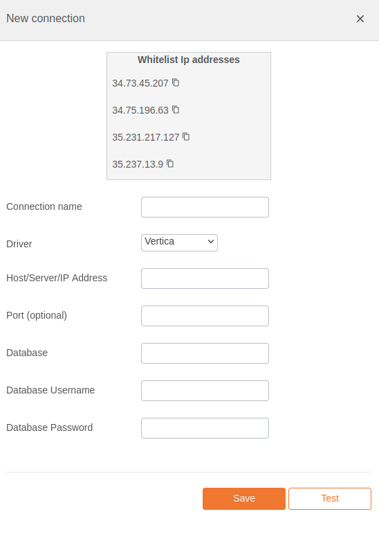

# Vertica Integration Documentation

## Table of Parameters

| Key        | Description            | Optional | Data Type |
|------------|------------------------|----------|-----------|
| `name`     | Name of connection     |          | text      |
| `driver`   | Must be vertica        |          | text      |
| `host`     | Host/Server/IP Address |          | text      |
| `port`     | Port                   | Yes      | text      |
| `database` | Database               |          | text      |
| `username` | Database Username      |          | text      |
| `password` | Database Password      |          | text      |

## Setup Information

To integrate Vertica with our system, follow these steps:

1. **Select the Vertica Connector:** Select the Vertica connector on import page in `Connection`
   modal.

2. **Configure Connection Parameters:** Use the parameters listed above to configure the connection
   to your Vertica instance.

3. **Verify Connection:** After configuring the parameters, verify the connection to ensure
   successful integration.

## Connection modal

## Additional Documentation

For more details and advanced configurations, refer to the
official [Vertica Documentation](https://www.vertica.com/docs/9.2.x/HTML/Content/Home.htm).

## Support

If you encounter any issues or have questions, please contact our support team.