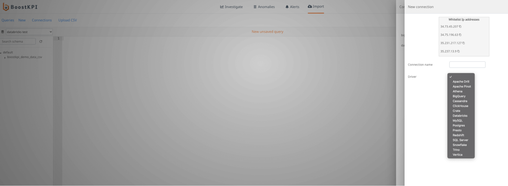
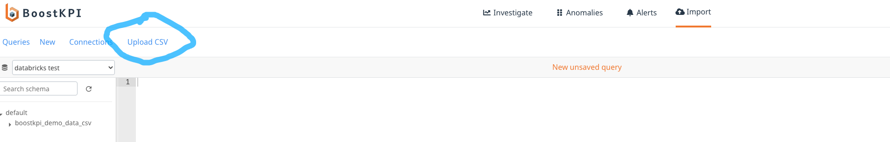

# Data import
{: .no_toc }

## Table of contents
{: .no_toc .text-delta }

1. TOC
{:toc}

## Supported data sources

BoostKPI can connect to many different data sources that support a SQL interface. The current list of supported data sources includes:
- AlloyDB
- Amazon Athena
- Amazon Redshift
- Apache Pinot
- Apache Drill
- Google BigQuery
- Cassandra
- ClickHouse
- Cloud SQL
- CrateDB
- Databricks
- DuckDB
- Microsoft SQL Server
- MySQL
- PostgreSQL
- PrestoDB
- Snowflake
- Trino
- Vertica

We only require read only access to the right table or view in the data source. For each integration, we use SQL queries to access the underlying data.

## IP address white-listing

Please whitelist the following 4 IP addresses so that BoostKPI can connect and run queries:
- 34.73.45.207
- 34.75.196.63
- 35.231.217.127
- 35.237.13.9

## Creating a dataset

Creating a dataset in BoostKPI is as simple as first creating a connection to your datasource and then selecting which table or view you would like to import. See [Importing data into BoostKPI](/docs/data-import/guide/#importing-data-into-boostkpi) for details.

## CSV file import

BoostKPI also supports one-off imports of CSV file. To import a file, go to the **Connect** page and select **Upload CSV** at the top.

### Types of supported csv imports

BoostKPI supports two types of csv imports: a timeseries csv and a lookup csv.

A timeseries csv is one that contains at least one timeseries column (date or timestamp) and has one or
more KPIs aggregated across one or more dimension values and the time column. For example, a csv file containing
the hourly revenue and orders data broken down by brand, country, and platform dimensions could be imported into a BoostKPI dataset.

A lookup csv is a csv file whose rows define a dimension lookup table that maps 
existing dimension values to new dimension values. BoostKPI joins this csv file 
with an existing time-series dataset to augment the dataset with a new dimension 
based on the dimension value mapping. For example, a csv file containing a mapping 
from a country to a continent could be imported to augment an existing dataset 
that countains country as a dimension with a new continent dimension.

## Import process

The document [Importing data into BoostKPI](/docs/data-import/guide/#importing-data-into-boostkpi)
provides more information about the import process.
