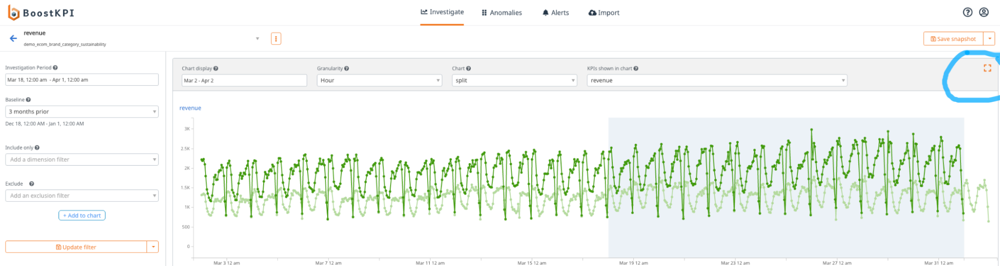

# Miscellaneous
{: .no_toc }

## Table of contents
{: .no_toc .text-delta }

1. TOC
{:toc}

## Why are we named "BoostKPI"

We pronounce BoostKPI as Boost-kay-pee-eye.  KPI stands for Key Performance Indicator(s) – the key metrics that business stakeholders use to measure, plan, and optimize the business’s performance. Here are example KPIs for different businesses:
- Retail: revenue, AOV (Average Order Value), number of purchases, number of product-views, product-view-to-purchase conversion rates.
- Paid marketing: impressions, clicks, CTR (Click-Through-Rates), purchases, ROAS (Return-On-Ad-Spend),, leads, CPL (Cost-Per-Lead)

The name BoostKPI captures our main goal –  make it easier, faster, and cheaper for businesses to boost their KPIs.

## I have a different question that is not covered here.

Please email your account manager or email us at contact@boostkpi.com

## How do I change the charts that are displayed in my dashboard-view?

To change the charts, click on the dashboard-view, update the charts (or the investigation period, 
baseline, the granularity of data, or the KPIs being displayed), and save the updated dashboard-view.

The changes should now reflect in the dashboard. 

## Charts on smaller screens
```
Q: I’m on a small screen and the chart looks really small. Can I just see the chart in full-screen?
```
Yes, just hit the rectangle button on the upper right corner of the chart display.


