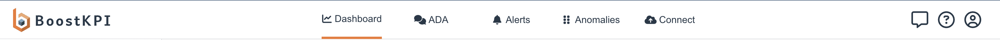

# Overview
{: .no_toc }

## Table of contents
{: .no_toc .text-delta }

1. TOC
{:toc}

### What is BoostKPI

[BoostKPI](https://boostkpi.com) is a ML-based platform that helps businesses find insights faster, better, and cheaper. Our key features include:
- Simple integration with cloud data warehouses  (like Google BigQuery, Amazon RedShift, Snowflake and Databricks) or other SQL databases (like Postgres, MySQL and Clickhouse).
- Waterfall charts, heatmaps, pivots, and drilldown visualizations for root cause analysis. Support for saving and sharing analyses, as well as receiving their periodic snapshots.
- Personalized alerts for each stakeholder via email/slack/webHook/text.
- Users can provide optional feedback on the alerts to improve the signal-to-noise ratio.

### Key features

The application has 4 key areas:
##### Dashboard
Use this tab to customize and access your "dashboard-views", investigate the root cause of any change in KPIs compared to any baseline, and save any investigations as "snapshots". “Snapshots” can be shared amongst team members.
##### Anomalies 
Use this tab to view anomalies that resulted from any of your configured alerts. These anomalies, besides being routed to users or to slack/teams, can also be viewed on the dashboard.
##### Alerts
Use this tab to set up granular alerts that combine unsupervised learning with business rules. The anomalies resulting from these alerts can be routed intelligently based on both the root cause as well as the magnitude of the deviation. The alerts can also be sent via slack.
##### Import
Use this tab to connect to the cloud data warehouse.

#### Website tour of the features on any page
Click in the upper right corner on question-mark icon.

### Dashboard overview video

An overview video of the root-cause analysis page is available at https://www.boostkpi.com/video.

For the alerting page, please look at https://blog.boostkpi.com/Sample-alerting-configurations/ to see alert configuration options. 

Our blog post at https://blog.boostkpi.com/Sample-alerting-configurations/ shows an example of a rolling 7-day alert for a daily dataset. 
