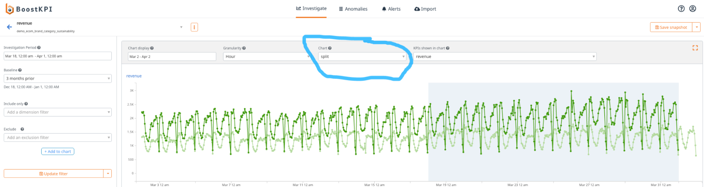

# Root-cause chart investigation
{: .no_toc }

## Table of contents
{: .no_toc .text-delta }

1. TOC
{:toc}

## Dataset granularity

You can aggregate your data in a chart for the dataset using the 
granularity select in the filters above the charts. 
For example aggregating daily dataset by month.

## Related KPIs

To view related KPIs on the chart, select the KPI from the 
**KPIs shown in the chart** dropdown.

## Data filters

To filter the shown data in chart, select the filter 
using "**include only**" filter on the left side and then 
click on "**add to chart**" button. 

## Merging charts into one

You can merge visible charts into single chart using "**absolute**" 
option from the **chart** dropdown.

