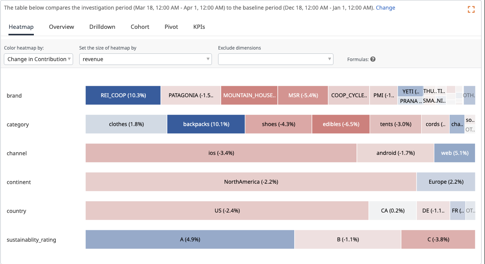

## Investigation period

For any investigation, BoostKPI compares two time-periods: the investigation period and the baseline period. The investigation period is the current time interval and the baseline period is computed based on the selected baseline and the investigation period. 

In the screenshot above, **revenue** is the KPI that is being analyzed, **demo_ecom_brand_category_sustainability** is the dataset, **Mar 18 - Apr 1** is the investigation period, and **3 months prior** defines the baseline, which is **Dec 18 - Jan 1**.

You can use the date filter to select a different investigation period. You can also select different baselines.

## Baseline

The baseline defines the comparison time period. ‘**2 weeks prior**’ means that the baseline period is 2 weeks prior to the investigation period. The baseline period corresponding to the chosen baseline is displayed below the dropdown.

Some other possible values of baseline are:
##### 5 days prior
The baseline period is set to the investigation period shifted 5 days prior. 
In the above example, it will be **Mar 13 - Mar 27**. Similarly, ‘**10 days prior**’ means 
that the investigation period is shifted by 10 days. Previously, the tool used **do5d** to refer to it.

##### 1 week prior
The baseline period is set to the investigation period is shifted a week earlier. 
For a daily dataset, **1 week prior** will have the same behavior as **7 days prior**. 
Similarly, **3 weeks prior** means that the investigation period is shifted 3 weeks prior. 
Previously, the tool used **wo3w** to refer to this baseline option.

##### mean4w
The baseline period is synthetically computed by averaging the values for each of the 
four prior weeks. If the investigation period contains May 29th, then the baseline value 
for May 29th is the average of the actual values for May 22nd, May 15th, May 8th, and May 1st. 
Baseline values for the rest of the investigation period are computed in the same manner.

##### meadian4w
The baseline period is synthetically computed by taking the median values for each of the four 
prior weeks (averaging the middle two). If the investigation period contains May 29th, then the 
baseline value for May 29th is the median of the actual values for May 22nd, May 15th, May 8th, 
and May 1st.

##### forecast
Fills in the baseline period with values computed via a machine learning forecast trained on 
the prior time period. Note: this baseline is not compatible with all the tabs below the timeseries.

## Tabs

The heatmap shows a visual representation of the dimension values that are important (captured by the size) as well as the dimension values that are driving the most change (captured by the color. Red means the growth is negative, Blue means the growth is positive).
The overview tab shows the heatmap values in a tabular format. 
The drilldown automatically shows the combination of dimension values that is driving the most change.

You can get contextual help by clicking the question-mark icon on the upper right. 

## Investigate page tour

You can get a tour by clicking the ? icon when you are on the investigate-page.

## Heatmap interpretation

The default option is to color the heatmap by “change in contribution”. In that case, 
the changes are normalized against the average change. If the box representing a dimension
value is colored red, it means it grew slower than average (even though it might have grown
compared to the baseline time period).

Clicking a cell sets the correct filter and regenerates the heatmap. 

